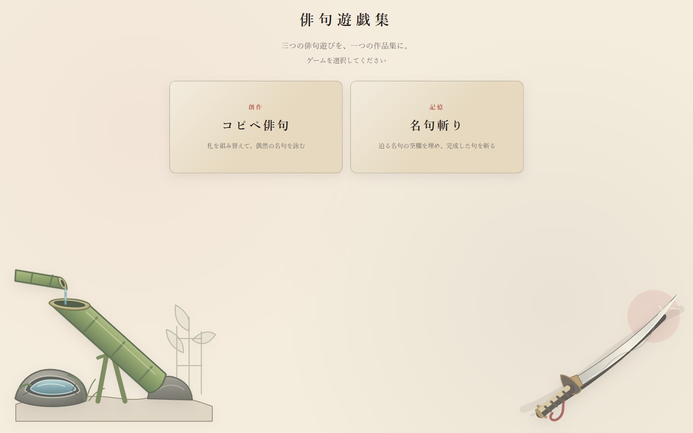
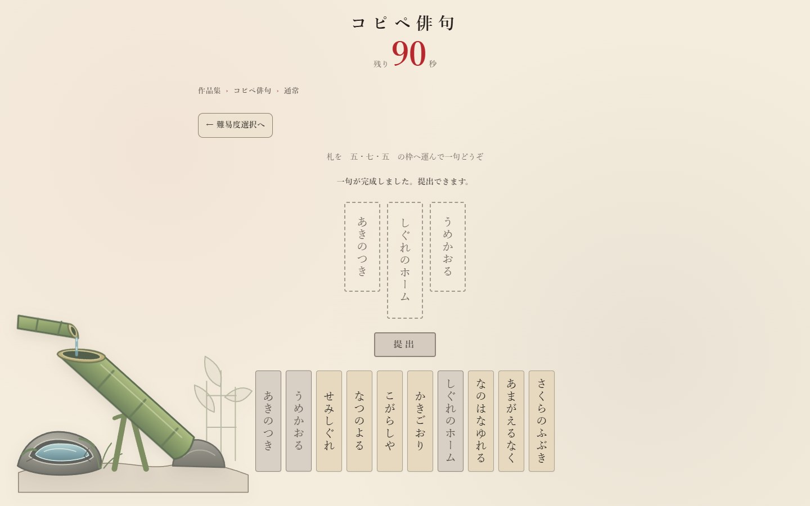
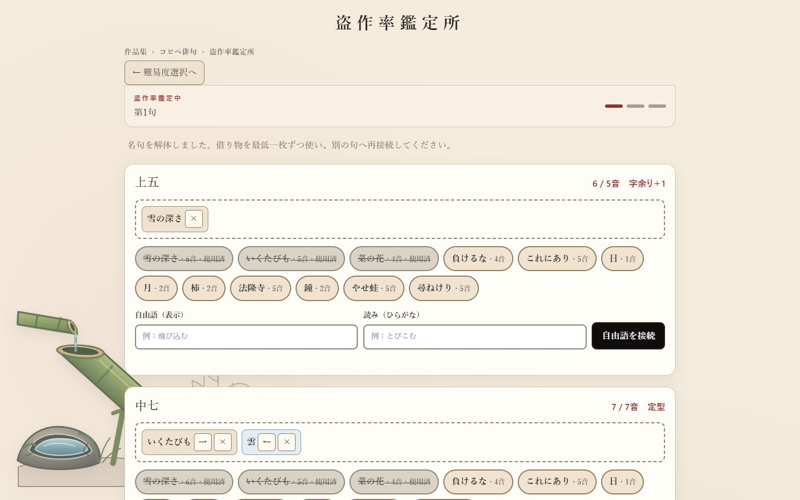
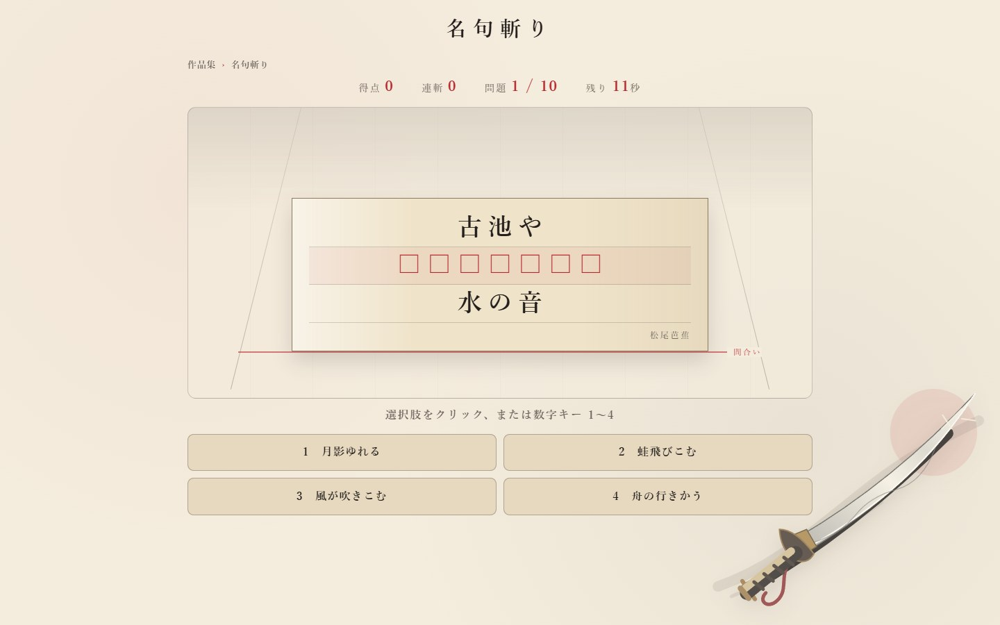

# 俳句遊戯集

> 俳句を「組み替える」「借りて作り直す」「記憶して斬る」の三方向から遊ぶ、一人用ブラウザゲーム作品集。

[ブラウザで遊ぶ（再公開時に有効）](https://homura-stack.github.io/haiku-yugishu/) · HTML / CSS / Vanilla JavaScript · PC / スマートフォン対応

外部APIや実行時通信に頼らず、タイトル画面から三つの遊びへ自由に移動できます。和紙・朱・墨を基調にしつつ、それぞれ異なる手触りの俳句体験を一つの作品としてまとめました。

## 画面

<table>
  <tr>
    <td align="center"><br><b>作品集トップ</b></td>
    <td align="center"><br><b>コピペ俳句</b></td>
  </tr>
  <tr>
    <td align="center"><br><b>盗作率鑑定所</b></td>
    <td align="center"><br><b>名句斬り</b></td>
  </tr>
</table>

## 三つの遊び

| モード | 目的 | 進行 | 主な操作 | 端末内の記録 |
| --- | --- | --- | --- | --- |
| コピペ俳句 | 五音・七音の札を五・七・五へ組み替える | 90秒で何句でも提出 | ドラッグ、タップ、キーボード | セッション履歴と最高点 |
| 盗作率鑑定所 | 4名句由来の12札と自由語から、新しい一句を作る | 3句を作り、各句の盗作率を鑑定 | 札の選択、自由語入力 | 300点満点の自己ベスト |
| 名句斬り | 欠けた名句を間合いへ届く前に完成させる | 古典28句から毎回10問 | 4択またはキーボード入力 | なし |

すべてのモードは最初から開放されています。通常モードと盗作率鑑定所では、プレイ途中に戻る場合だけ破棄確認を表示します。

## 作品としての工夫

- **創作・引用・記憶を一つのテーマへ接続** — 同じ俳句でも、偶然性、独創性、知識を別々のルールで遊べます。
- **通信なしで完結** — 札、名句、採点、批評をオフラインバンドルへ埋め込み、`index.html`の直接起動にも対応しています。
- **操作方法を限定しない** — マウスのドラッグだけでなく、タップとTab＋Enterでも作句できます。
- **状態を言葉でも伝える** — 選択中、使用済み、入力エラー、提出できない理由、残り秒数を色だけに頼らず表示します。
- **動きが苦手な環境へ配慮** — `prefers-reduced-motion`では名句の接近演出を止め、制限時間は秒数表示で伝えます。
- **外部UIライブラリ不使用** — 実行時はHTML、CSS、Vanilla JavaScriptのみです。Tailwind CSSはCSS生成時だけ使用します。

## 技術構成

```text
index.html        作品集の全画面とアクセシビリティ情報
src/              ゲーム進行、採点、保存、3モードのロジック
data/             札データ、名句データ、出典情報
styles/           共通UIと各モードのスタイル原稿
dist/             通信なしで動く配布用CSS・JavaScript
tests/            Nodeテスト
e2e/              Google Chromeによる実画面テスト
scripts/          オフラインビルド、静的サーバー、画像生成
```

- HTML
- Tailwind CSS（ビルド時のみ）
- Vanilla JavaScript（ES Modules）
- Node.js標準テストランナー
- Playwright / Google Chrome（開発時のE2Eのみ）

実行時にBootstrap、jQuery、anime.js、Pixi.jsなどの外部ライブラリは読み込みません。

## ローカルで遊ぶ

依存関係を入れずに遊ぶ場合は、`index.html`をGoogle Chromeで直接開きます。

静的サーバーを使う場合:

```powershell
node scripts/serve-static.mjs 4173
```

その後、`http://127.0.0.1:4173/`を開きます。

## 開発と検証

```powershell
npm.cmd install
npm.cmd test
npm.cmd run build
npm.cmd run test:browser
node --check dist\app.js
```

- Nodeテスト: **67件**
- Google Chrome E2E: **6シナリオ**
- 検証幅: PC（1280×900）／スマートフォン（390×844）
- E2E対象: 3モード導線、再入場、二度の完走、ドラッグ、タップ、キーボード、誤答ロック、保存不能、動きの抑制、`file://`起動、横スクロール、コンソールエラー

README画像を再生成する場合:

```powershell
npm.cmd run capture:readme
```

## 名句・出典・保存データ

名句斬りと盗作率鑑定所では、松尾芭蕉、与謝蕪村、小林一茶、正岡子規の句を扱います。4名の句の原文は著作権保護期間を満了したパブリックドメイン作品です。現代の解説文や現代語訳は収録していません。

- 名句斬りの収録方針と主な参照先: [data/MEIKU_SOURCES.md](data/MEIKU_SOURCES.md)
- 盗作率鑑定所の12句と個別出典: [data/hard-source-haiku.json](data/hard-source-haiku.json)
- ライセンスと権利範囲: [LICENSE.md](LICENSE.md)

保存にはブラウザの`localStorage`を使い、サーバーへ送信しません。保存が拒否された場合も、その回のプレイと結果表示は継続します。

## 対応環境

PC版・スマートフォン版Google Chromeを対象としています。外部通信を必要としないため、静的ホスティングとオフライン起動の両方で動作します。

---

© 2026 homura-stack
